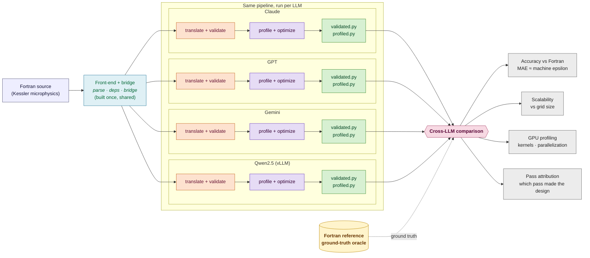

# LAFT Architecture

**Framework:** LAFT — LLM-Assisted Fortran Translation Framework
**Case study:** Kessler microphysics (`../kessler/`) — the
framework is project-agnostic; all project-specific values live in
`config/project.toml` (see `README.md` §Generic vs project-specific).

Single-pipeline view of how a Fortran procedure becomes a verified,
hardware-efficient JAX translation. Four stages, sequenced by
`../ORCHESTRATOR.md`: a deterministic, LLM-agnostic front-end (stage 0,
Band A), the bridge generator with its own test gate (stage 1, Band A'),
an LLM-driven translation workflow (stage 2, Band B), and an optional
GPU-driven profiler/optimization workflow (stage 3, Band C). Stages 2 and 3
reuse the same completeness (scaffold = stop) → lint → semantic audit (gated)
→ runtime → driver → comparison validation gate against the Fortran
reference oracle.

```mermaid
flowchart TB
    %% ===== Inputs =====
    FSRC["Fortran source<br/>data/src/*.F90"]:::input
    POL["prompt_policies/*.md<br/><i>source of truth</i>"]:::input
    REF[("Fortran reference I/O<br/>data/fortran_io/<br/><b>validation oracle</b>")]:::oracle

    %% ===== BAND A: deterministic front-end (stage 0) =====
    subgraph A["A · Deterministic front-end &nbsp;(stage 0 — LLM-agnostic, runs once)"]
        direction TB
        P1["Phase 01<br/>tree-sitter parse<br/><i>one file or many</i>"]:::det
        P2["Phase 02<br/>dependency analysis"]:::det
        P1 --> P2
    end

    %% ===== BAND A': bridge (stage 1) =====
    subgraph A2["A' · Bridge &nbsp;(stage 1 — generated, gated)"]
        direction TB
        P3["Phase 03<br/>bridge generation<br/><i>PATH C: in-jit layout conversion, batched D2H</i><br/>contract 1 host-facing · contract 2 device-resident"]:::bridge
        BGATE{"Bridge test gate<br/>layout + dependent + contract-2 equivalence + vertical symmetry"}:::gate
        P3 --> BGATE
    end

    %% ===== BAND B: LLM translation =====
    subgraph B["B · Translator workflow &nbsp;(LLM-driven, iterative)"]
        direction TB
        P4["Phase 04<br/>generate multi-pass prompts<br/><i>identical for every LLM</i>"]:::llm
        MP["Four-pass translation<br/>1 draft → 2 JIT safety → 3 vectorization → 4 annotate<br/><i>{proc}_passN.py kept</i>"]:::llm
        GATE{"Validation gate<br/>completeness (scaffold = STOP) → lint → semantic audit (gated: audit_gate.py) → runtime → bridge suite → driver → comparison<br/><i>driver+comparison once per declared contract</i>"}:::gate
        FIX["Fix loop<br/>(patch out/jax, ≤5 attempts per error)"]:::fix
        SNAP["{proc}.validated.py<br/>+ translation_report.md"]:::out
        P4 --> MP --> GATE
        GATE -- fail --> FIX --> GATE
        GATE -- pass --> SNAP
    end

    %% ===== BAND C: profiler workflow =====
    subgraph C["C · Profiler workflow &nbsp;(GPU-driven, iterative)"]
        direction TB
        PROF["Profile<br/>nsys + jax.trace (PBS)"]:::prof
        DIAG["Diagnose<br/>hardware efficiency"]:::prof
        PFIX["Fix<br/>(edit out/profiled, ≤5)"]:::fix
        REVAL{"Re-validate<br/>completeness → lint → audit (gate) → runtime → driver → comparison"}:::gate
        PROF --> DIAG --> PFIX --> REVAL
        REVAL -- not ready --> PROF
        REVAL -- production_ready --> PDONE["{proc}.profiled.py<br/>+ profile_report.md"]:::out
    end

    %% ===== Plug: swappable LLM =====
    LLM(["LLM — [translator] in config<br/>in-context agents (Claude Code · Gemini CLI · Codex)<br/>or one-shot vLLM on PBS (Qwen)"]):::plug

    %% ===== Edges between bands =====
    FSRC --> A
    A -- "packets" --> A2
    A -- "packets" --> P4
    BGATE -- "PASS (entry gate)" --> P4
    POL --> P4
    LLM -.swappable.-> MP
    SNAP -- "hand-off gate" --> PROF

    %% ===== Oracle feeds both comparison steps =====
    REF -. ground truth .-> GATE
    REF -. ground truth .-> REVAL

    %% ===== Optional: multi-LLM fan-out =====
    SNAP -. "×N LLMs" .-> CMP["Cross-LLM comparison<br/>accuracy · scalability · profiling · pass attribution"]:::cmp
    PDONE -.-> CMP

    classDef input fill:#eef,stroke:#557,color:#113;
    classDef oracle fill:#fff4cc,stroke:#b80,color:#630,font-weight:bold;
    classDef det fill:#dff0f5,stroke:#2a7a9b,color:#063;
    classDef bridge fill:#cfe9d9,stroke:#2a8a5b,color:#063;
    classDef llm fill:#fde2cf,stroke:#c4631a,color:#613;
    classDef gate fill:#f7d9e3,stroke:#a83b62,color:#503;
    classDef fix fill:#f3c9c9,stroke:#a33,color:#500;
    classDef prof fill:#e6dcf5,stroke:#6a3bbf,color:#303;
    classDef out fill:#d7f0d2,stroke:#3a8a2a,color:#042;
    classDef plug fill:#fff,stroke:#888,stroke-dasharray:4 3,color:#333;
    classDef cmp fill:#ececec,stroke:#666,color:#222;
```

## Legend

| Band | Stage | Nature |
|------|-------|--------|
| **A** | 0 — Phase 01 parse → 02 deps | Deterministic, LLM-agnostic static analysis; runs once |
| **A'** | 1 — Phase 03 bridge → test gate | Generated plumbing (PATH C, two contracts); its gate is Stage 2's entry condition |
| **B** | 2 — Phase 04 prompts → four-pass translation → validation gate | LLM-driven, iterative (fix loop ≤5 per error per file) |
| **C** | 3 — Profile → diagnose → fix → re-validate | GPU-driven, iterative (loop ≤5), optional |

- **Fortran reference** is the persistent ground-truth oracle feeding the comparison step in *both* workflows.
- **prompt_policies/** are the source of truth for prompt generation — edit those, then regenerate prompts. The four prompts are identical for every LLM, which is what makes cross-model pass attribution meaningful.
- **LLM** is a swappable plug selected by `[translator]` in `config/project.toml`. In-context agents (Claude Code, Gemini CLI, Codex) author the passes inside an agent session; one-shot models (Qwen) author them through a vLLM PBS job with fixed sampling (each has its own folder, e.g. `workflow_translator/qwen/`, holding the module doc + drivers). Repair is always the driving agent's, regardless of author, and never alters the loop structure. The dashed `×N → cross-LLM comparison` fan-out feeds the project's `_compare_results/`.
- **Two bridge contracts**: `{proc}_bridge` (host arrays in/out) and `{proc}_bridge_device` (device-resident); which one the application uses is a per-project decision recorded in `[driver].contracts` (see `NEW_PROJECT_CHECKLIST.md` §6).

## Stages and their steps

Every stage is entered through `../ORCHESTRATOR.md` (Step 0 picks the scenario;
a **user-approval pause** separates consecutive stages; a failed gate ends the
run). Scripts are LAFT-shared and symlinked into each project
(`workflow_*/`, `validation/`, `pbsJobs/`); project-specific inputs live in
`config/project.toml` and in the project's own `bridge_test/`, `[driver].script`,
`[comparison].script`, `[profiler].inputs_script`. Login-node rule: only parsing,
generation, lint, audits and edits run there — **everything that executes JAX
goes through PBS** (`pbsJobs/`).

### Stage 0 — Frontend (`workflow_frontend/FRONTEND_WORKFLOW.md`, Band A)

Deterministic, LLM-agnostic, runs once per Fortran source; no fix loop
(an error is an environment or unsupported-Fortran problem). Env: tree-sitter
(`conda-envs/ts`).

| step | script | produces |
|---|---|---|
| 1 Parse | `phase01_01_ts_parse.py` | `out/procedures/`, `out/modules/`, `out/programs/`, `out/phase1_index.json` (one merged index across `[source].fortran_files`; check the per-file `syntax_ok`) |
| 2 Base packets | `phase02_01_procs_JSON.py` | `out/packets/<proc>.json` (source, skeleton, OpenMP, parent module, direct module-var refs) |
| 3 Dependencies | `phase02_02_deps_JSON.py` | `out/packets/<proc>_deps.json`, `_ALL_deps.json` (args, writes, effects, calls, `jax_required`, `scalar_only`) |
| 4 Merge | `phase02_03_merge_packets_JSON.py` | `out/packets/<proc>_merged.json` (+ transitive module-var closure in declaration order — the canonical signature) |
| 5 Module graph | `phase02_04_module_dependencies.py` | `out/module_dependencies.json`, `out/procedure_call_graph.svg` |

**Exit gate:** `phase1_index.json` lists the expected procedures, every
procedure has a `_merged.json`, `_ALL_deps.json` non-empty, no script error.

### Stage 1 — Bridge (`workflow_bridge/BRIDGE_WORKFLOW.md`, Band A')

Generated Fortran↔JAX plumbing, testable **before** any translation exists.

| step | script | produces |
|---|---|---|
| 1 Generate | `phase03_make_bridge.py` | `out/bridge/<proc>_bridge.py` — PATH C (in-jit axis reversal, ONE batched D2H), MODULE vars as INOUT parameters, two entries per array-bearing procedure: **contract 1** `<proc>_bridge` (host NumPy in/out) and **contract 2** `<proc>_bridge_device` (device-resident); plus loop-swap / GPU-efficiency analysis reports under `out/reports/bridge/` |
| 2 Test gate | `run_bridge_tests.py` (→ `bridge_test_results.json`, `bridge_report.md`) | runs the project's `bridge_test/`: **layout suite** (fake pass-through core, translation-independent: transfer helpers, roundtrip identity, C-order outputs, reversed kernel-side layout, statics concrete, strings host-side, module vars threaded) must pass with zero skips; the translation-**dependent** suite (functional, contract-2 ≡ contract-1 bit-identity, vertical symmetry) self-skips until Stage 2 and is re-run there at Step 4.5 with `--require-dependent` |

**Exit gate:** `out/reports/bridge/bridge_test_results.json` → `"status": "PASS"`
(Stage 2's entry condition). Which contract the application uses is a
per-project decision recorded in `[driver].contracts` (`NEW_PROJECT_CHECKLIST.md` §6).
New-project checklist (7 items incl. `TESTING_GUIDE.md` and the LAFT test
templates) in `BRIDGE_WORKFLOW.md`.

### Stage 2 — Translate (`workflow_translator/TRANSLATE_WORKFLOW.md`, Band B)

LLM-driven and iterative; the LLM is a plug (`[translator]`: in-context agent
or one-shot vLLM job), repair is always the driving agent's. State lives in
`out/jax/workflow_state.json` (`translate_workflow_state.py`), every step is
timestamped there.

| step | what happens | tool / output |
|---|---|---|
| 0 Resume check | read the state file; resume from `status`/`next_steps`, never restart silently | `workflow_state.json` |
| 1 Plan | fresh runs regenerate prompts + reference wrappers from `prompt_policies/` (`phase04_01`, `phase04_02`); topological order from `_ALL_deps.json` (Kahn); pass count per procedure (1 plain-Python scalar · 2 JAX-scalar · 4 full JAX); print the plan | `out/prompts/<proc>_pass*.md`, `out/wrappers/` |
| 2 Authoring loop | per procedure in order: passes 1 draft → 2 JIT safety → 3 vectorization → 4 annotate (`<proc>_passN.py` kept), mandatory LLM version header, hard rules; state stamped after **each** procedure (2d) | `out/jax/<proc>.py` |
| **2.5 Completeness** | `phase04_04_completeness_check.py --proc <proc>` after each procedure and once for the set: scaffold phrases / commented-out callees ⇒ **FAIL = HARD STOP** (`status aborted_scaffold`, no automatic retry — a model/context limit, human decides); absent callees, extreme size ratio, scalar-only misclassification ⇒ WARN | `out/reports/translation/completeness_check.json` + `completeness_report.md` |
| 2e Freeze | `phase04_03_translation_stats.py freeze` — the immutable four-pass record (Table 1) | `out/reports/translation/pass_stats.json` |
| 3 Lint | `validation/phase05_01_lint_translation.py` — structure (header, `_core`, `@jax.jit`, wrapper …); must be 100 | `out/lint/` |
| **3.5 Semantic audit (gated)** | `phase05_01b_semantic_audit.py` — fidelity to the Fortran, text-vs-text on the login node: `calls-invoked` (FAIL), `update-terms` (FAIL, `[semantic_audit].prognostic_vars`), `table-reads` (FAIL, `[[table_readers]]`, executes the LUT reader numpy-only), `lut-indices` (FAIL), `zero-forever`, `intent-out`, `missing-consts`, `labelled-blocks`, `direction-masks` (WARN), waivers with justification in `out/issues/semantic_audit_waivers.json`; **3.5b** the agent's formula-by-formula audit when 3.5a warns or paraphrasing is suspected. `audit_gate.py` = single decision point: completeness fresh & not FAIL, status ≠ `aborted_scaffold`, `_summary.json` + report fresh, 0 unwaived FAIL | `out/issues/semantic_audit/<proc>.json`, `_summary.json`, `out/reports/translation/semantic_audit_report.md` |
| 4 Runtime validation | `qsub pbsJobs/jax_gpu_runtimevalid.sh` (**refused while the audit gate is closed**, by the state tool and by the PBS script): every module imports, wrapper smoke-tested through its bridge, every `_core` jit-traced; read the `.o` log, not stale JSON | `out/validation/<proc>_runtime.json` |
| 4.5 Bridge suite | `workflow_bridge/run_bridge_tests.py --require-dependent` as a CPU PBS job (`pbsJobs/jax_cpu_test.sh`): layout + dependent + contract-2 equivalence tests (+ vertical-symmetry where the project carries it) all **run** (skips count as failure) | `out/reports/bridge/*` |
| 5 Driver + comparison | once **per declared contract** (`[driver].contracts` → `LAFT_DRIVER_MODE=host|device_resident`): `qsub <[hpc].driver_job>` runs the project driver against the Fortran reference inputs, then `qsub pbsJobs/jax_gpu_compvalues.sh` runs `[comparison].script`; gate = `ALL PASS` in **every** declared mode; per-mode artifacts copied aside since both modes overwrite `out/driver/` | per-variable driver outputs in `out/driver/` (kessler: `theta.txt`, `qv.txt`, …) + `kessler_driver.json`, `compare_results_fortran_jax.txt`, `compare_fortran_jax.json` |
| 6 Fix loop | patch the final `out/jax/<proc>.py` directly (never re-run a pass); ≤5 attempts per (file, error); every attempt logged in `workflow_state.json → fix_attempts`, `fix_stats.jsonl` (Table 2) and `out/issues/fix_log.md`; each fix re-closes the audit gate until the audit is re-run | `aborted_max_fix_attempts` on exhaustion |
| 7 Snapshot | `out/jax/<proc>.validated.py` for every procedure once comparison is green | |
| 8 Report | `out/reports/translation/translation_report.md`: header, plan, **Table 1 (frozen) + Table 2 (live)** rendered by `phase04_03 … render`, **completeness + semantic audit section**, results table, files, fix log, lessons — written even on abort | |

**Exit gate:** comparison `ALL PASS` in every declared mode + report with both
tables (ORCHESTRATOR Stage-2 row). Then the project's `tools/copy_AI_results.sh`
archives `out/` to `translations/<name>/`.

### Stage 3 — Profile (`workflow_profiler/PROFILE_WORKFLOW.md`, Band C, optional)

GPU-driven, iterative, on a **staged copy** of the validated target procedure
(`[profiler].staged_code`); `out/jax/` is untouched until a re-validated fix is
copied back. State in `profile_workflow_state.py`.

| step | phase | what happens | output |
|---|---|---|---|
| 0 | — | resume check | profile state file |
| 1 | — | stage the working copy, record its hash | `[profiler].staged_code` |
| 2 | A Profile | `qsub -v ITERATION=N pbsJobs/jax_gpu_profile_trace.sh`: `jax.profiler.trace` at two `ncol` points + XLA HLO dump | `<out_dir>/iteration_N/<proc>_trace.json`, `_code_info.json`, `_hlo.txt`, Perfetto traces |
| 3 | B Diagnose | `diagnose.py` — the single source of `production_ready` and the three check verdicts: column-loop structure (while-iteration scaling with `ncol`), fusion quality (XLA event count), D2H copies | `<proc>_diagnosis.json` |
| 4 | C Fix | minimal targeted edit of the staged copy for the failing check; ≤5 attempts per (file, check); logged in state + `fix_log.md`; back to Phase A with N+1 | |
| 5 | D Re-validate | **mandatory after any substantial fix**: copy back and run completeness → lint → semantic audit (gate must be OPEN, else runtime is refused) → runtime → driver → comparison (skippable only if the staged hash equals the validated baseline) | validation artifacts |
| 6 | E nsys | `qsub pbsJobs/jax_gpu_profile_nsys.sh` once per converged code: device kernel times, launches, memcpys, idle gaps — attached to the diagnosis, informational (never gates) | `<proc>_stats.json` |
| 7 | — | headroom analysis: cost ladder (end-to-end → data movement → host dispatch → device kernels), device-idle fraction, top constructs by file:line, 3–5 ranked bounded recommendations (`headroom_patterns.md`); the bridge-contract choice is at most a prose hint | `out/reports/profile/profile_report.md`, `<proc>.profiled.py` |

**Exit gate:** `production_ready` from `diagnose.py` + re-validation green +
nsys pass + report. Then archive.

### After the stages — cross-LLM comparison (`_compare_results/`, per project, not framework code)

Accuracy vs Fortran, scalability vs grid size, GPU profiling, pass attribution,
and the contract benchmark/decision tier that feeds `[driver].contracts`.

## Rendering

- **GitHub:** renders automatically when viewing this file.
- **mermaid.live:** paste the `flowchart TB …` block (without the fences) to tune/export SVG/PNG.
- **CLI:** save a block to `architecture.mmd` and run `mmdc -i architecture.mmd -o architecture.svg` (requires `npm i -g @mermaid-js/mermaid-cli`).

---

# Multi-LLM Fan-out

Results-oriented view: the deterministic front-end and bridge are built **once**, then the
same pipeline is run independently per LLM (Claude · GPT · Gemini · Qwen on kessler).
Each lane produces a verified + profiled JAX translation, and all lanes re-converge at a
cross-LLM comparison that reports accuracy (vs Fortran), scalability, GPU profiling, and —
because the pass intermediates are kept — at which pass each design decision was made.

**Reading the diagram**
- The story reads left→right: *one* front-end → *N* parallel lanes → *one* comparison → results.
- The result nodes map to the project's `_compare_results/` outputs (accuracy, scalability, and profiling reports and plots); for kessler see `kessler/_compare_results/outputs/`.
